### 1.透過 systemctl 啟動 nginx
```bash
sudo systemctl start nginx
```

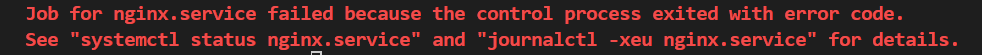<br>
**結果:** nginx service無法啟動<br>

### 2.透過 sudo nginx -t 查看 /etc/nginx/nginx.conf語法
```bash
sudo nginx -t
```

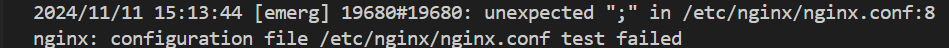<br>
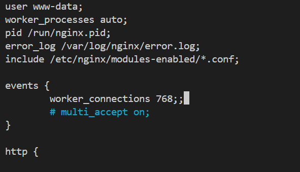<br>
**結果:** ```/etc/nginx/nginx.conf```第八行多了一個分號<br>

### 3.修改 /etc/nginx/nginx.conf 權限
```bash
sudo chmod 644 /etc/nginx/nginx.conf
```
**結果:** ```/etc/nginx/nginx.conf```可讀可寫<br>

### 4.去掉 /etc/nginx/nginx.conf第8行分號
```bash
sudo nano /etc/nginx/nginx.conf
```
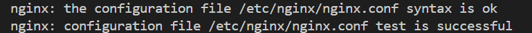<br>
**結果:** <br>
1. ```/etc/nginx/nginx.conf```語法修正成功<br>
2. ```sudo systemctl start nginx```仍然出現錯誤<br>
   <br>

### 5.查看nginx.service狀態
```bash
sudo systemctl status nginx.service
```
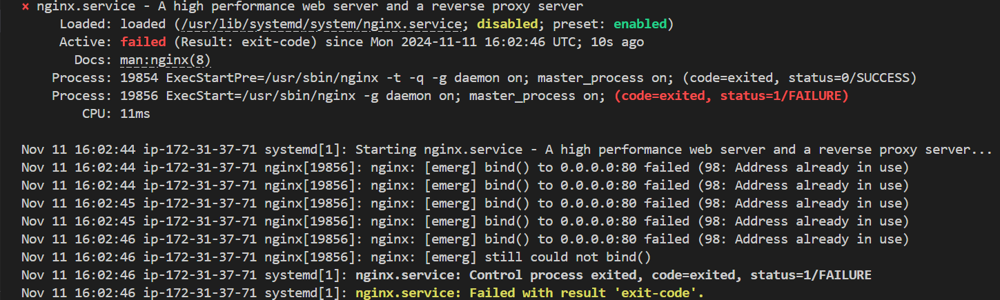<br>
**結果:** port 80被占用<br>

### 6.解決port占用問題
```bash
sudo lsof -i :80
```
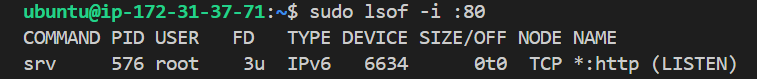<br>

```bash
sudo systemctl stop srv
```
```bash
sudo systemctl disable srv.service # 將其自動啟動的設定停用
```
```bash
sudo lsof -i :80
```
<br>

```bash
sudo systemctl start nginx
```
```bash
sudo systemctl enable nginx # 設置 Nginx 為開機自動啟動
```
```bash
sudo systemctl status nginx
```
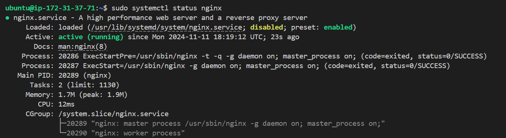<br>
**結果:** <br>
1. 成功啟動nginx server<br>
2. ``` curl localhost``` <br>
   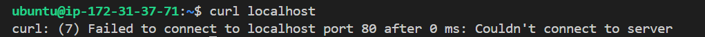<br>

### 7.防火牆
```bash
sudo iptables -L -n
```
發現一條 REJECT     6    --  0.0.0.0/0            0.0.0.0/0            tcp dpt:80 reject-with icmp-port-unreachable
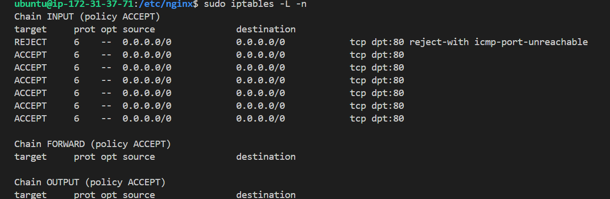<br>

```bash
sudo iptables -A INPUT -p tcp --dport 80 -j ACCEPT
```

```bash
sudo iptables -D INPUT [line number]
```
將目前的 iptables 防火牆規則保存到 /etc/iptables/rules.v4 文件中
```bash
sudo sh -c "iptables-save > /etc/iptables/rules.v4"
```

**結果:** <br>
```curl localhost```出現 <br>
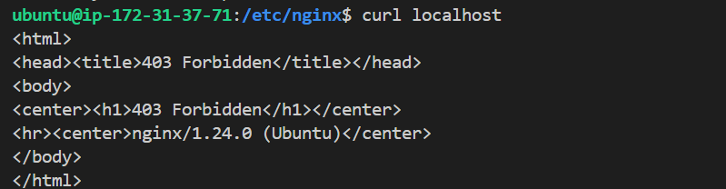<br>

### 8. 查看log
```bash
cat /var/log/myweb/error.log
```
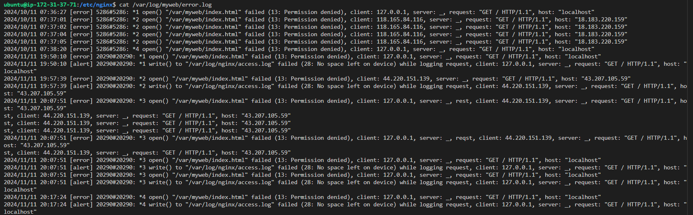<br>
**結果:** <br>
1 **Permission Denied ((13: Permission denied)):** nginx的default user ```www-data```沒有訪問```/var/myweb/index.html```的權限<br>
2 **No Space Left on Device ((28: No space left on device)):** 因為磁碟空間不夠的原因，nginx無法寫入```/var/log/nginx/access.log```<br>

### 9. 解決權限與磁碟問題
#### 1 權限:
```bash
# Set ownership to the Nginx user (usually www-data on Ubuntu)
sudo chown -R www-data:www-data /var/myweb
```
(Optional)
```bash
# Ensure the directory and files are readable by the Nginx user
sudo chmod -R 755 /var/myweb
```

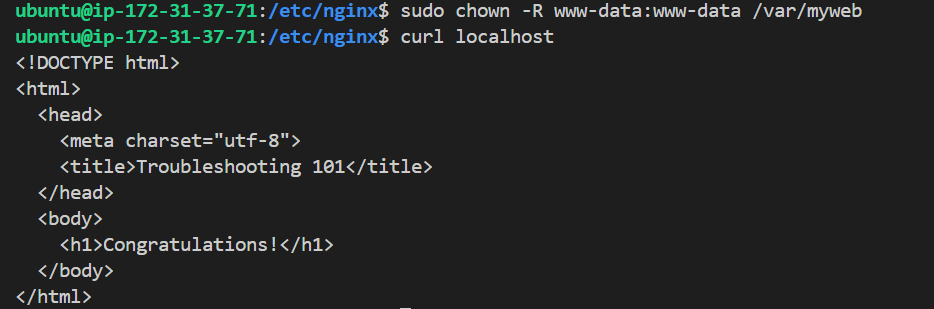<br>

#### 2 磁碟:
```bash
# Check your disk space with the following command to confirm that the system has indeed run out of space
df -h
```
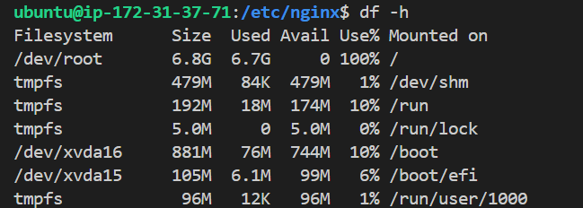<br>

```bash
# If the disk is full, you can free up some space by clearing old logs or removing unnecessary files. To clear the Nginx logs, use
sudo truncate -s 0 /var/log/nginx/access.log
sudo truncate -s 0 /var/log/nginx/error.log
```

